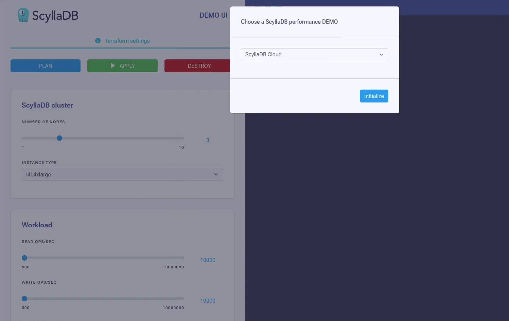
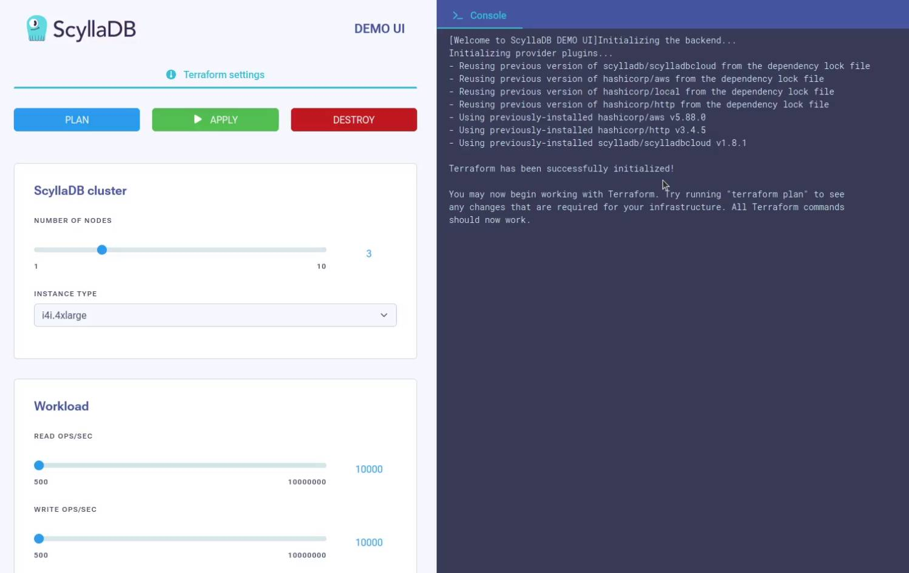

# DEMO UI: ScyllaDB in different cloud environments

<p><iframe width="560" height="315" src="https://www.youtube.com/embed/-nPO9KeNydM?si=wkCRK5ZJ0cfz9h4u" title="YouTube video player" frameborder="0" allow="accelerometer; autoplay; clipboard-write; encrypted-media; gyroscope; picture-in-picture" allowfullscreen></iframe></p>

Currently supported DEMOs:
* ScyllaDB Cloud 1 million operations/second (AWS and ScyllaDB Cloud account needed)
* ScyllaDB Enterprise 1 million operations/second (AWS account needed)
* Scaling from 3 to 6 nodes (AWS account needed)


## Prerequisites
* [AWS CLI](https://aws.amazon.com/cli/)
* [Docker](https://docker.com)
* [ScyllaDB Cloud API key](https://cloud.scylladb.com/)

## Usage
1. Clone the repository
    ```
    git clone https://github.com/scylladb/1m-ops-demo.git
    cd 1m-ops-demo/
    ```
1. Make sure AWS CLI is configured properly, and know the location of the credentials file (e.g. `~/.aws/credentials`)
1. Edit `config.py`
    ```json
    {
        "aws_creds_file": "/home/user/.aws/credentials",
        "region": "us-east-1",
        "scylla_cloud_token": "API-TOKEN",
        "running_in_docker": true
    }
    ```
    * `aws_creds_file`: the location (absolute path) of your AWS credentials file
    * `region`: AWS region you want to use for the demo
    * `scylla_cloud_token`: You can generate an API token in ScyllaDB Cloud
    * `running_in_docker`: Normally this should be `true`
1. Run the web app (by default, it uses port 5000)
    ```bash
    ./build_and_run.sh 
    ```
    This will spin up a Docker container and run the web app on the `5000` port. You can stop the container with `docker stop scylla-demo`
1. Open DEMO UI application
    
    Go to http://0.0.0.0:5000
1. Select a demo you want to try (this will run `terraform init` under the hood)
    
1. (Optional) Configure cluster size and workload settings on the left side
    
1. Hit `APPLY` (this runs `terraform apply`)
1. Keep an eye on the console output to see when Terraform finishes
1. Click on the different dashboard tabs to monitor the cluster.
1. If you are done, don't forget to run `DESTROY` to remove infrastructure elements and avoid unnecessary costs.
